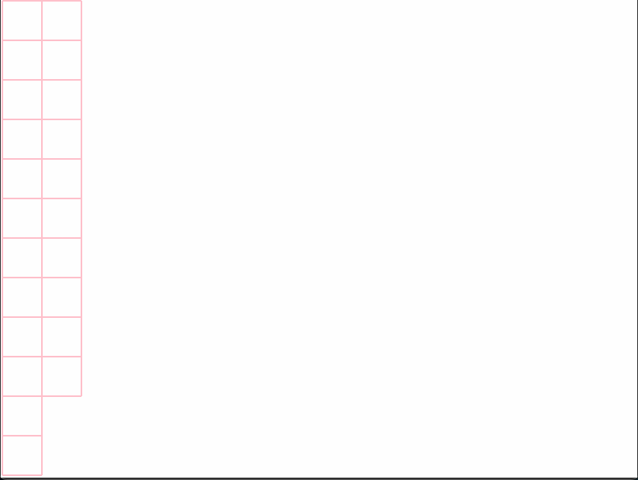

# a-maze-ing
A program that generates a random maze and solves it. The purpose of this project was to train on knowledge of algorithms.

# How it works

Upon initialization the maze draws a matrix/grid of cells. Each cell is an object that tracks four walls and wether or not it has been visited. Once the grid is complete the maze "punches" holes in the start (first cell in matrix) and end (last cell in matrix) by setting top and bottom wall respectively to False. After that a DFS (Depth first search) algorithm is used to create the maze layout, this is where the visited attribute of cell plays an important role. Starting at the first cell, each neighbor of that cell is visited. Upon each visitation a hole is punched between the two cells. This continues untill the end cell has been reached. After that all `Cell.visited` attributes are reset and the program will start solving the maze using DFS again. 

# Demonstration

# How to use

Adjust the arguments of Maze initialization in `main.py`, run it and watch it go!
